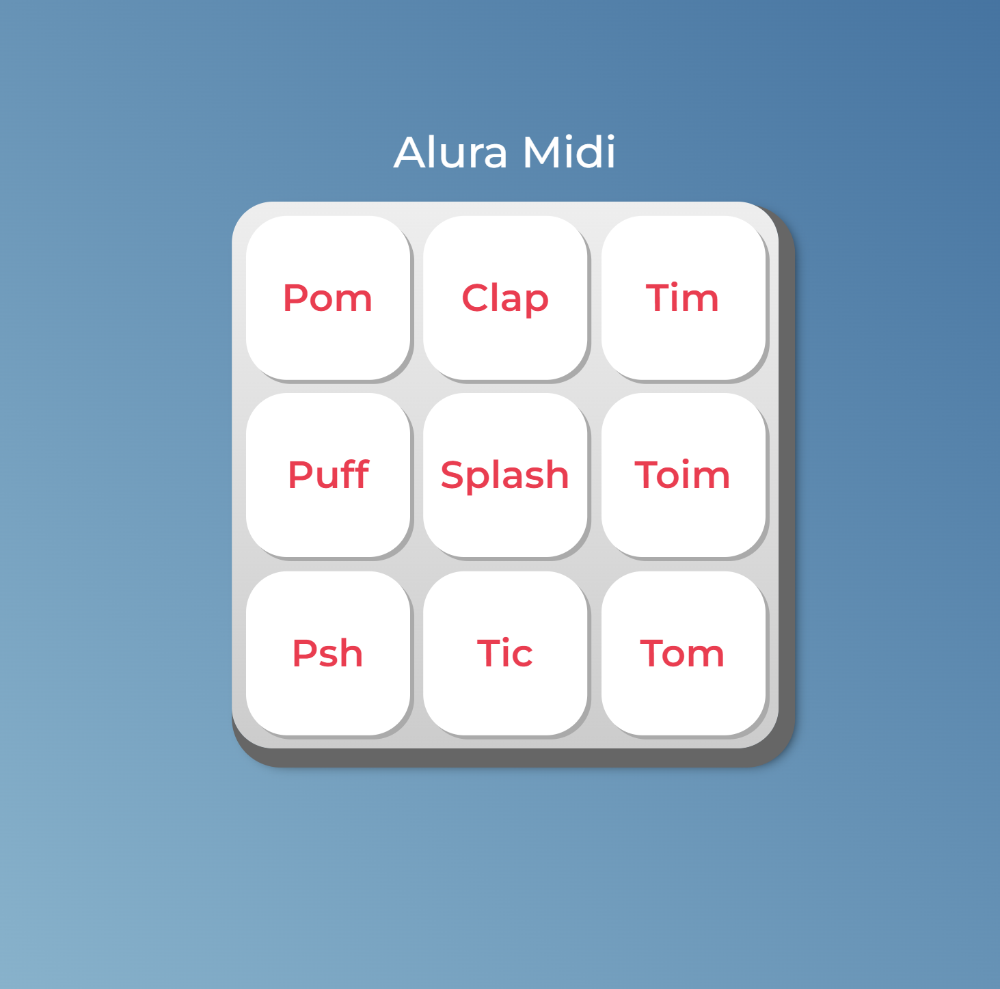

# Alura Midi

Desenvolvido para aprendizado. Realizado durante aula de Javascript na plataforma da Alura, o projeto Alura Midi é um instrumento digital, simulando o som de uma bateria. 30/11/2022

[🔗 Clique aqui para acessar] (https://michel-maia.github.io/Alura-Midi/)

## 💻 Tecnologias

- Javascript

## Referência

- [Alura] https://www.alura.com.br/escola-front-end

